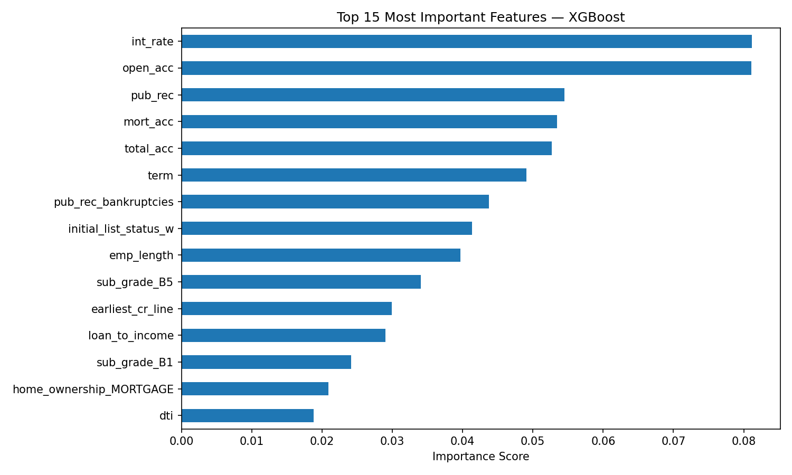

# 💳 Credit Risk / Loan Default Prediction

Predicting the probability that a loan will default, using LendingClub's
historical loan data.

## 📌 Problem
Lenders need to estimate default risk in order to price loans correctly and
set approval thresholds. This project builds and compares machine learning
models to predict whether a borrower will repay or default on a loan.

## 📊 Data
LendingClub historical loan data (395219 rows). Target variable: whether a loan
was Fully Paid (1) or Charged Off / defaulted (0). Features include loan
amount, interest rate, borrower income, debt-to-income ratio, credit history
length, employment length, and loan purpose.

## 🛠 Approach
1. Cleaned missing values and removed non-predictive/leaky columns (e.g. address, issue date)
2. Engineered new features, including a loan-to-income ratio
3. Handled class imbalance using SMOTE, since defaults are a minority class
4. Trained and compared Logistic Regression, Random Forest, and XGBoost
5. Evaluated using ROC-AUC, precision, and recall (not just accuracy, since the classes are imbalanced)

## 📈 Results

| Model | ROC-AUC | Recall (default) | Precision (default) |
|---|---|---|---|
| Logistic Regression | 0.705 | 0.30 | 0.41 |
| Random Forest | 0.695 | 0.19 | 0.43 |
| XGBoost | 0.700 | 0.15 | 0.46 |

**Logistic Regression was selected as the final model.** Although the tree-based
models achieved slightly higher overall accuracy, this is misleading on an
imbalanced dataset: they do so by predicting "repaid" more aggressively,
missing the majority of actual defaults. Logistic Regression achieved both the
highest ROC-AUC (0.705) and the highest recall on defaults (30%, vs. 15-19%
for the tree models) — directly more useful for a lender, since the cost of
missing a default is typically much higher than the cost of a false alarm.

### Feature Importance

**Key takeaway:** Feature importance was examined using the XGBoost model for
interpretability, even though Logistic Regression was ultimately selected as
the final model based on its stronger recall on defaults.

## 💼 Business Takeaway
A model like this lets a lender flag higher-risk applications for closer review
or adjusted pricing, rather than applying the same terms to every borrower
regardless of risk — directly supporting credit risk and underwriting decisions.

## 🧰 Tech Stack
Python, pandas, scikit-learn, XGBoost, matplotlib, imbalanced-learn (SMOTE)

## 📂 Files
- `credit_risk_model.ipynb` — full analysis, cleaning, modeling, and evaluation
- `feature_importance.png` — top feature importance chart
- `requirements.txt` — Python packages needed to run the notebook
